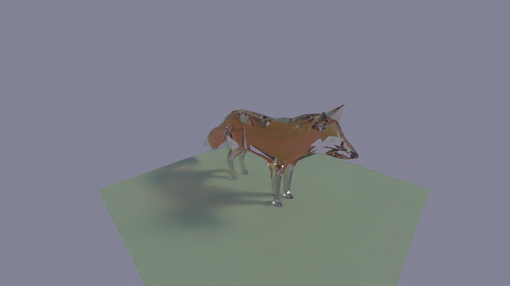
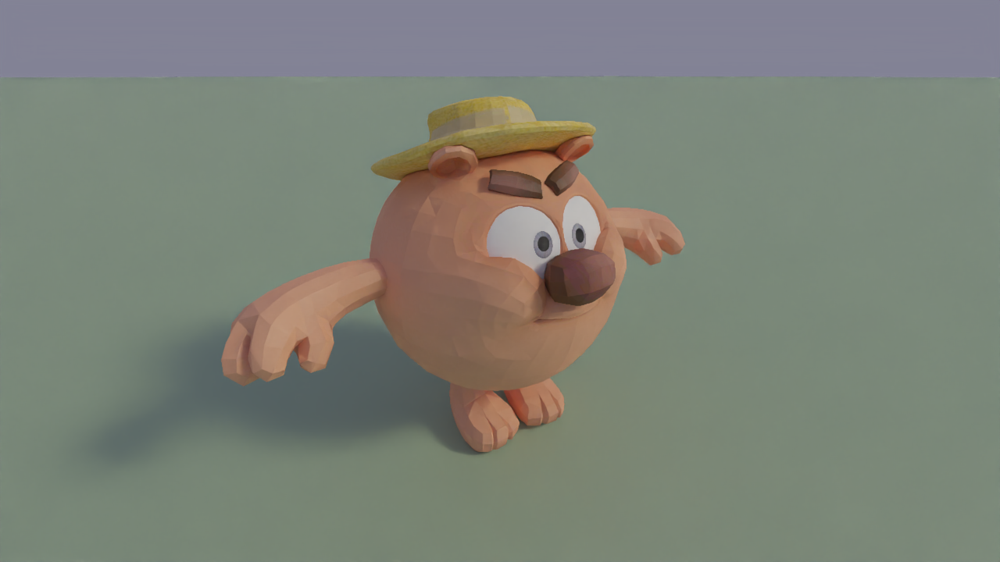
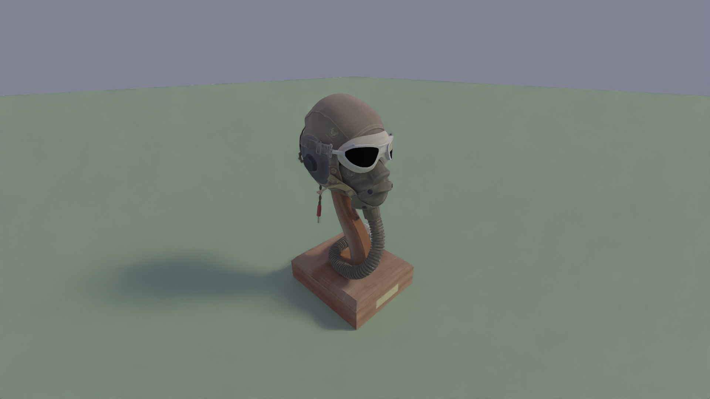
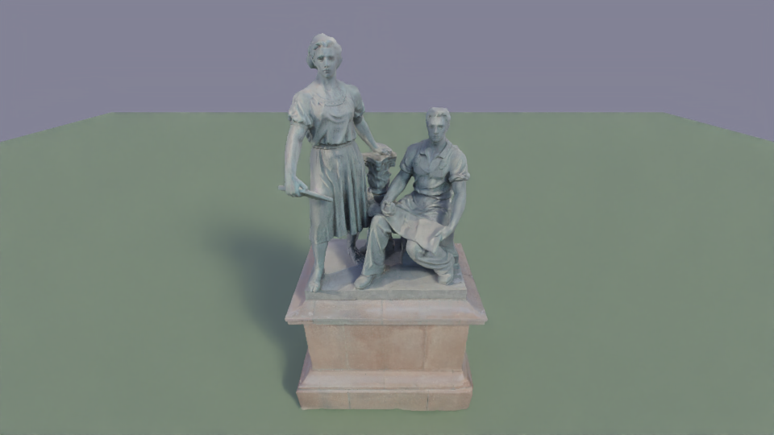

# PriZm

[](https://isocpp.org/)
[](https://cmake.org/)
[](https://www.opengl.org/)
[](https://www.docker.com/)

## Headless OpenGL compute shader Path Tracer using EGL

## Demos

<table>
  <tr>
    <td></td>
    <td></td>
  </tr>
  <tr>
    <td></td>
    <td></td>
  </tr>
</table>


An offline renderer that runs entirely without a display server,
using EGL for GPU-accelerated rendering in headless environments

## Key features:
- GLSL compute shaders for path tracing
- EGL for headless rendering
- .glb/.gltf scene loading
- Open Image Denoiser
- Debug images output: raw, albedo, normals
- Logging system
- Unit tests
- Docker support

## Usage

```bash
./renderer <width> <height> <samples> <input_scene> [OPTIONS]
```
###  Command line arguments

| Argument | Type | Description |
|----------|------|-------------|
| `width` | `int` | Output image width |
| `height` | `int` | Output image height |
| `samples` | `int` | Number of samples per pixel |
| `input_scene` | `string` | Path to .glb/.gltf scene file |

### Command line options

| Option | Type | Description |
|--------|------|-------------|
| `-h, --help` | `-` | Show help message |
| `-o, --output` | `string` | Output image path (default: output.png) |
| `-v, --verbose` | `-` | Enable detailed logging |
| `-d, --debug` | `-` | Save debug images (raw, albedo, normals) |
| `-p, --plane` | `float` | Add ground plane at scene center with specified size |
| `-c, --camera` | `vec3 vec3 float` | Set camera: `position lookAt fov` |

### Example

```bash
./renderer 1920 1080 50 tests/data/test-scene.glb -o scene.png --plane 15 --verbose
```

## Build

### 1. Build with Docker

```bash
docker build -t renderer .
docker run --rm renderer --help
```

### 2. Native build
```bash
cd renderer
mkdir build && cd build
cmake ..
cmake --build .
./renderer --help
```
